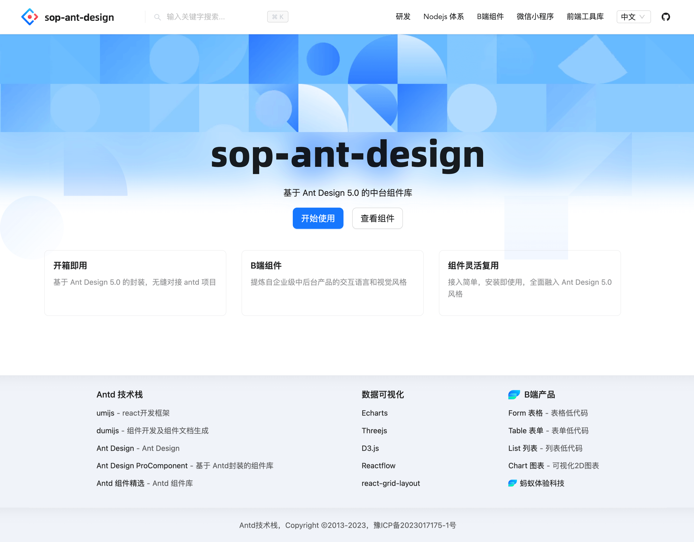

# sop-antd

[dumi 嘟米- 为组件研发而生的静态站点框架](https://d.umijs.org/)

1. 资产元数据
2. 为组件开发场景而生的静态站点框架
  * [father4](https://github.getafreenode.com/umijs/father) 负责组件源码构建，https://github.com/umijs/father
    * 双模式构建： 支持 Bundless 及 Bundle 两种构建模式，
    * ESModule 及 CommonJS 产物使用 Bundless 模式
    * UMD 产物使用 Bundle 模式
  * dumi2.3.8 负责组件开发及组件文档生成
3. 内置全文搜索
4. Umi 是前端开发框架，适用于前端应用研发
5. dumi 是在 Umi 的基础上打造的静态站点框架，适用于组件研发



基于 dumi部署了一套系统

1. 设计
   1. 样式库
   2. UI动效库
2. 研发
   1. 组件库
   2. 模板库
3. 资源
   1. 图标库
   2. 原型库
4. 物料广场
   1. 示例库


## dumi 创建项目

创建项目

```bash
# 先找个地方建个空目录。
mkdir myapp && cd myapp

# 创建项目
npx create-dumi

# 选择一个模板
? Pick template type › - Use arrow-keys. Return to submit.
    Static Site # 用于构建网站
❯   React Library # 用于构建组件库，有组件例子
    Theme Package # 主题包开发脚手架，用于开发主题包

✔ Pick template type › React Library
✔ Pick NPM client › pnpm
✔ Input NPM package name … sop-antd
✔ Input project description … A react library developed with dumi
✔ Input project author (Name <email@example.com>)

# start
npm run dev

# site 模版
npm run build

# react 模版
npm run docs:build
```


### dumi 目录结构

```tree
├── .dumi
├── .dumirc.ts # dumi 配置文件
├── .fatherrc.ts # father 配置文件，用于组件库打包
├── README.md
├── dist # 打包后的组件目录
├── docs # 文档
├── docs-dist # 打包后的文档
├── node_modules
├── package.json
├── pnpm-lock.yaml
├── src # 组件目录
├── tailwind.config.js
└── tsconfig.json
```

静态站点（`Static Site` 选项），忽略上面的 `src` 目录，关注 docs目录

【docs 文档路由】通常放在 docs 目录下，会嵌套层级

【src 资产路由】通常放在 src 下，不会嵌套层级、且默认归类在某一前缀

* 文档路由 docs
  * 自动过滤掉以 `.` 和 `_` 开头的文件及文件夹，仅识别 `.md` 后缀的文件
* 组件资产路由 src
  * dumi 默认会将 `src` 下的文档都归类到 `/components`


dumi 层级嵌套 https://git.homegu.com/umijs/dumi/issues/748


### .dumi

约定 `.dumi/tmp*` 为框架的临时文件，由 dumi 在编译过程中自动生成，**请勿直接修改或在代码中引入它们**

这些文件由 dumi 在编译过程中自动生成，**请勿直接修改或在代码中引入它们**

.dumi/pages 自定义 React组件页面，识别规则与文档路由一致

* dumi 会自动将文件路径中的驼峰命令（CamelCase）转换为中划线命名（kebab-case)

`.dumi/global.less` 新增组件全局样式

`.dumi/overrides.less`：覆盖 dumi 默认主题或三方主题包的样式，该文件中的规则会自动提升一层优先级确保覆盖生效

`.dumi/global.(js|jsx|ts|tsx)` 为全局脚本文件

`.dumi/app.(js|jsx|ts|tsx)` 为运行时配置文件，用于修改框架运行时配置的场景

`.dumi/loading.(js|jsx|ts|tsx)` 为全局 loading 组件

`.dumi/pages/404.(js|jsx|ts|tsx)` 为自定义 404 页面

`.dumi/favicon.(ico|gif|png|jpg|jpeg|svg|avif|webp)` 为站点 favicon 图标，当存在任一后缀文件时，dumi 将会自动在 HTML 中插入对应的 `link` 标签以应用 favicon

`.dumirc.ts` 中的 `styles` 配置项加载了组件库样式表


## config 配置

group 始终对应左侧 menu，只会在 doc 模式下存在

nav 对应导航头，两者在 site 模式下会同时存在


### theme

dumi-theme-antd Antd Design 5.0 官网

https://kuangpf.com/dumi-theme-antd/config/base


### plugin

* dumi 语法高亮使用的 [prism-react-renderer](https://github.com/FormidableLabs/prism-react-renderer) ，基于 [PrismJS](https://github.com/PrismJS/prism) 实现的 React 组件
* 静态站点（`Static Site` 选项），忽略 `src` 目录结构


### 自定义首页

创建 `.dumi/pages/index.tsx` 即可用 React 来编写首页，注意不要同时在文档解析的根目录中创建 index.md，会导致路由冲突

dumi 约定 `.dumi/pages` 为 React 路由的解析目录，较为复杂的交互式页面可以在这个目录下用 React 编写，路由的生成规则及 FrontMatter 能力与 md 一致


### 不支持 CSS Modules

cssModule 最终 `className` 是动态的，不稳定

cssModule 依赖 babel 编译产物，给使用项目带来额外的编译成本

大部分人在组件库项目中使用 cssModule，是因为做前端应用研发时的习惯性选型，

但 cssModule 其实不适合组件库项目；另外也会产生额外的调时成本：导致为什么 dev 生效、发布后在项目里不生效？


## docs 文档

/docs 文档目录

npm run docs:build，产出 docs-dist目录，为打包后的文档目录


### second 二级菜单

https://d.umijs.org/guide/conventional-routing

```markdown
---
title: node package manager
order: 0
description: 描述
keywords: [关键词]

group: NPM
nav:
  second:
    title: 'node package manager'
    order: 5
---
```


### group 菜单分组

需要归类的每一篇文档都需要设置菜单分组名称，但菜单分组顺序仅需要**任一文档**设置即可生效

选择一种方式就行

```markdown
---
# 单独设置分组名称
group: 基础

# 同时设置分组名称和顺序，order 越小越靠前，默认为 0
group:
  title: 基础
  order: 1
---
```


## build 构建项目

npm run docs:build ` 构建产物输出到`docs-dist，构建站点，部署到ECS服务器

npm run build构建产物输出到es，构建组件，发布到 npm

```bash
# install dependencies
pnpm install

# develop library by docs demo
pnpm start

# build library source code
pnpm run build

# build library source code in watch mode
pnpm run build:watch

# build docs
pnpm run docs:build

# Locally preview the production build.
pnpm run docs:preview

# check your project for potential problems
pnpm run doctor

# 一键发布
pnpm run deploy
```


### dist 组件

/src 组件库源码目录

npm run build，产出 dist目录，为打包后的组件代码目录


### 非根目录部署

非根目录部署需要修改 Umi 的 [base 配置项](https://d.umijs.org/config#base) 和 **视实际情况** 修改 [publicPath 配置项](https://d.umijs.org/config#publicpath)

```ts
export default {
  base: '/文档起始路由/',
  publicPath: '/静态资源起始路径/',
  // 其他配置
};
```


## git


```bash
git init 
git add .
git commit -m "first commit"

git remote add origin https://gitee.com/langwen/component-platform-dumi.git
git push -u origin "master"

# git global
git config --global user.name "**文"
git config --global user.email "112345@qq.com"
```


## dumi 常见问题

https://d.umijs.org/guide/faq


### 首页空白

dumi-theme-antd@0.2.2 大于 2.2版本的，首页内容为空，class="markdown"，

升级前一定先测试好，再升级
